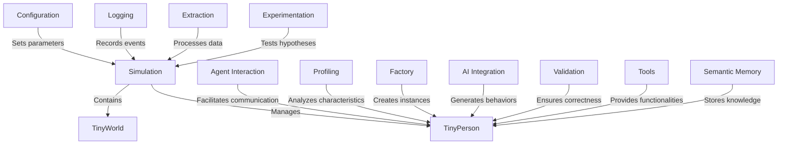

# Tutorial: TinyTroupe

**TinyTroupe** is a simulation framework designed to create and manage *virtual agents* that interact within a *dynamic environment*. It allows users to explore various scenarios and behaviors through realistic agent interactions and decision-making processes. With components for profiling, validation, and AI integration, TinyTroupe aims to provide a rich experience for experimenting with agent-based modeling.

**Source Repository:** [https://github.com/microsoft/TinyTroupe](https://github.com/microsoft/TinyTroupe)

## Chapters

1. [Simulation](01_simulation.md)
2. [TinyPerson](02_tinyperson.md)
3. [TinyWorld](03_tinyworld.md)
4. [Agent Interaction](04_agent_interaction.md)
5. [AI Integration](05_ai_integration.md)
6. [Profiling](06_profiling.md)
7. [Experimentation](07_experimentation.md)
8. [Validation](08_validation.md)
9. [Tools](09_tools.md)
10. [Extraction](10_extraction.md)
11. [Logging](11_logging.md)
12. [Configuration](12_configuration.md)
13. [Semantic Memory](13_semantic_memory.md)
14. [Factory](14_factory.md)

---

Generated by [AI Codebase Knowledge Builder](https://github.com/The-Pocket/Tutorial-Codebase-Knowledge)